# EarthquakeApp
Türkiye'deki depremleri inceleyebilirsiniz. Deprem anında bildirim yollanmaz.

Kandilli Rasathanesi'nin API'si ve Kotlin Jetpack Compose kullanılarak MVVM ve Clean Architecture ile oluşturulmuş Android Deprem Uygulaması.

## Uygulama Önizlemeleri

  
  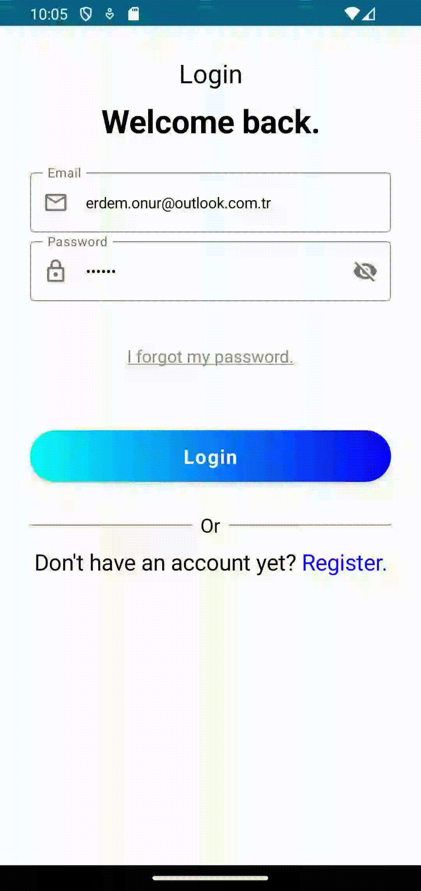
  
  
  
  
  

  
  

## Uygulama Ekran Görüntüleri

Splash Ekranı | İlk Onboarding Ekranı | İkinci Onboarding Ekranı | Üçüncü Onboarding Ekranı | Kayıt Ekranı | Kullanım Koşulları Ekranı Başı
:-------------------------:|:-------------------------:|:-------------------------:|:-------------------------:|:-------------------------:|:-------------------------:
 | 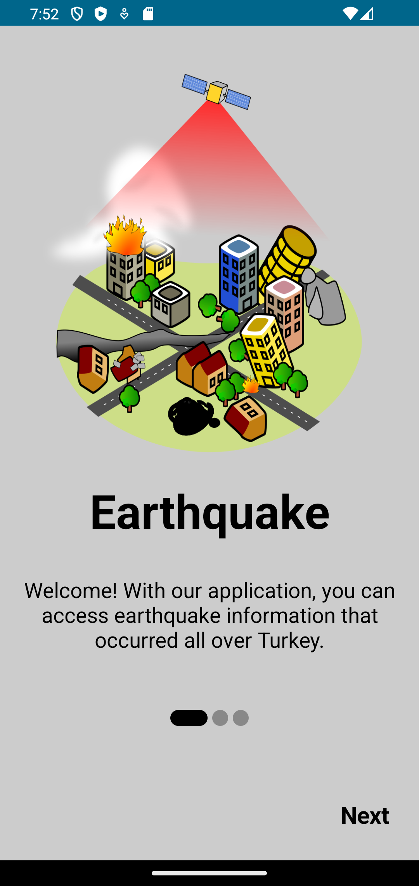 | 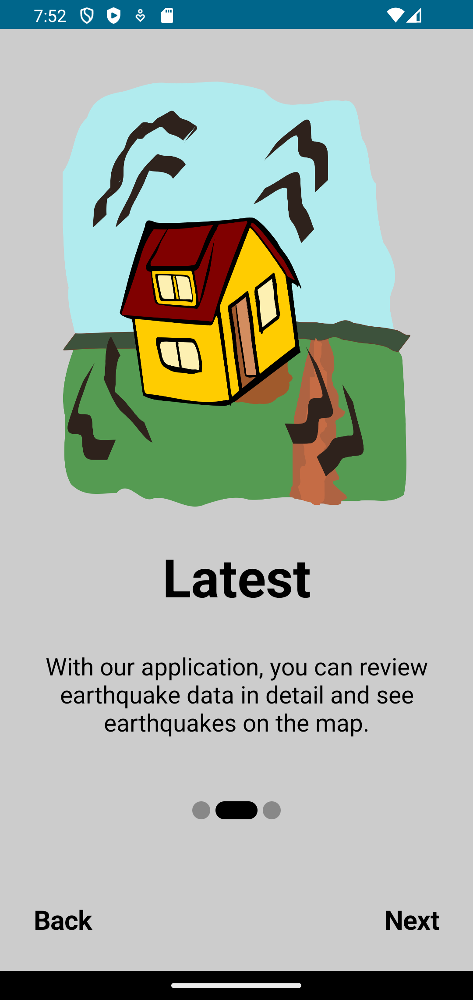 | 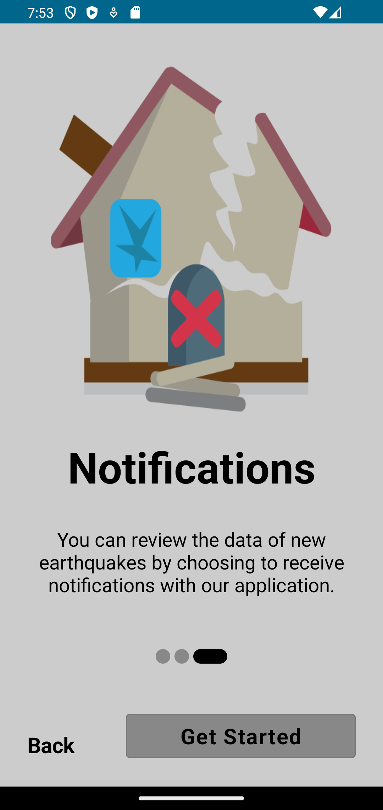 | 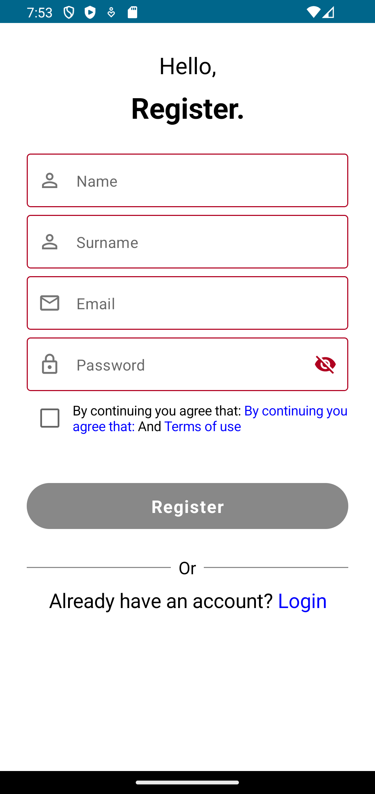 | 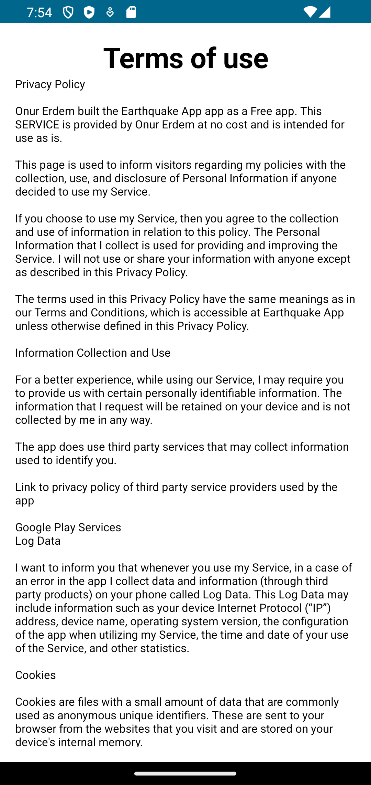 |

Kullanım Koşulları Ekranı Ortası | Kullanım Koşulları Ekranı Sonu | Giriş Ekranı | Parola Sıfırlama Ekranı | Depremler Ekranı |
:-------------------------:|:-------------------------:|:-------------------------:|:-------------------------:|:-------------------------:|
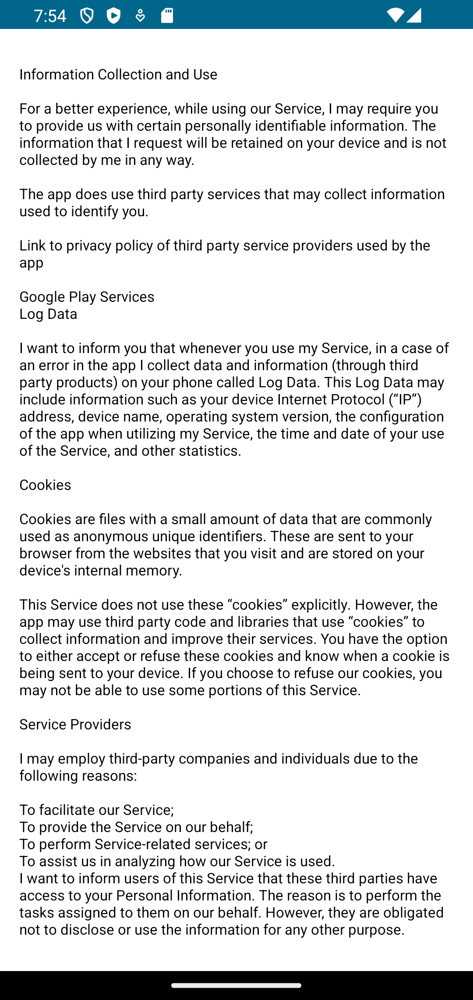 | 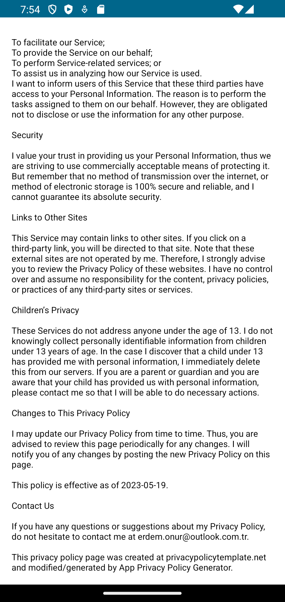 | 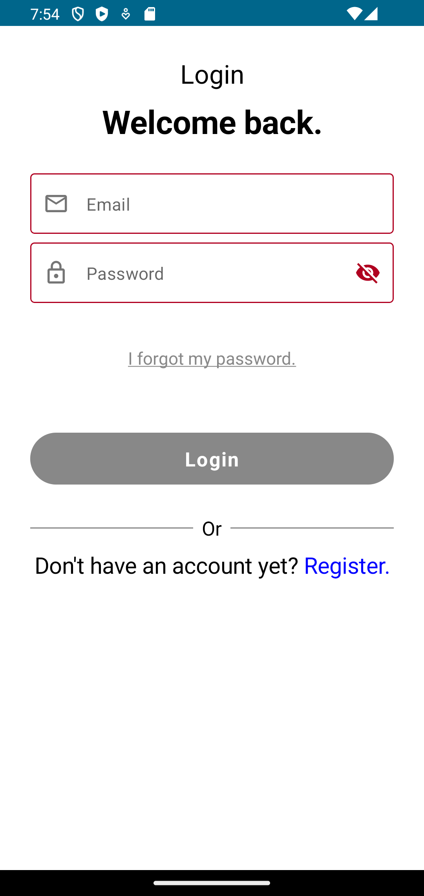 |  | 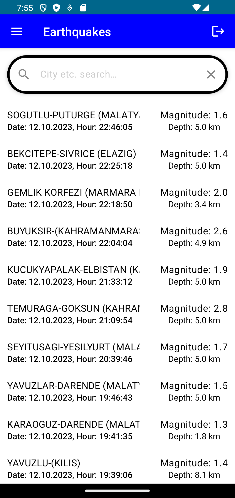 |

Profil ve Ayarlar Ekranı | Deprem Detayları Ekranı Başı | Deprem Detayları Ekranı Ortası | Deprem Detayları Ekranı Sonu | Arama Ekranı |
:-------------------------:|:-------------------------:|:-------------------------:|:-------------------------:|:-------------------------:|
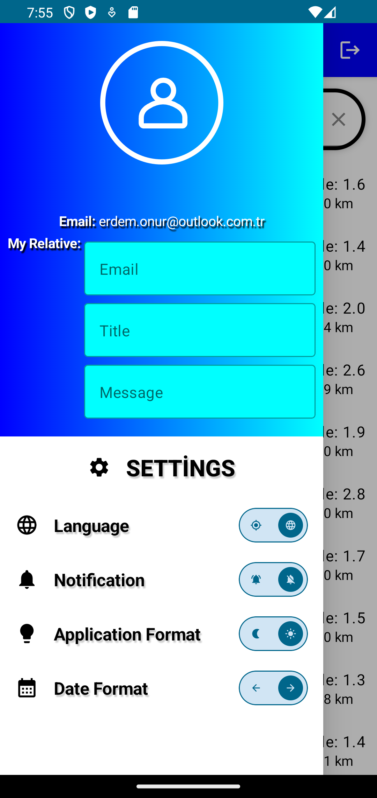 | 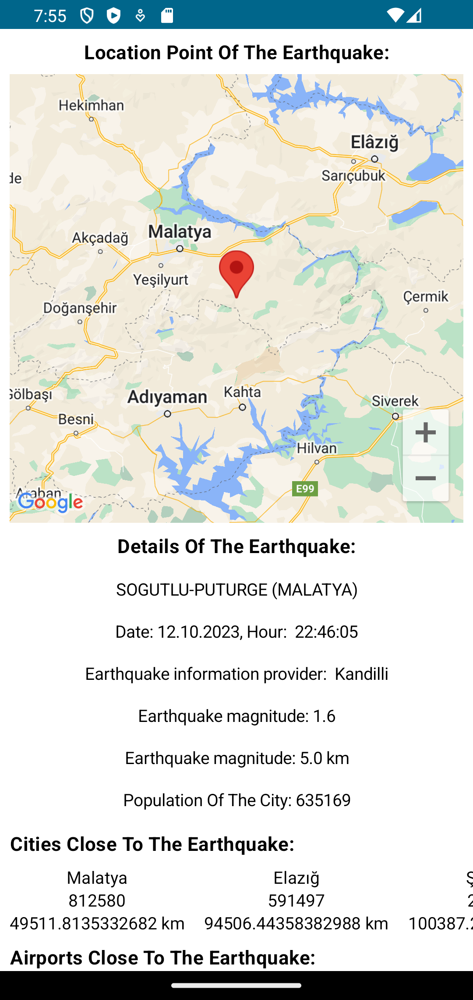 | 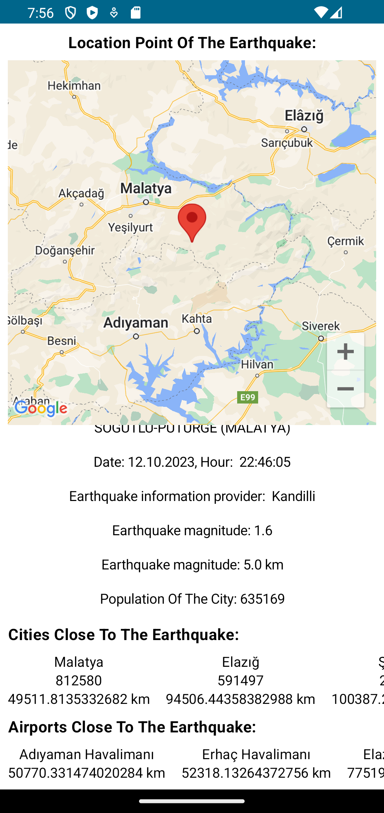 | 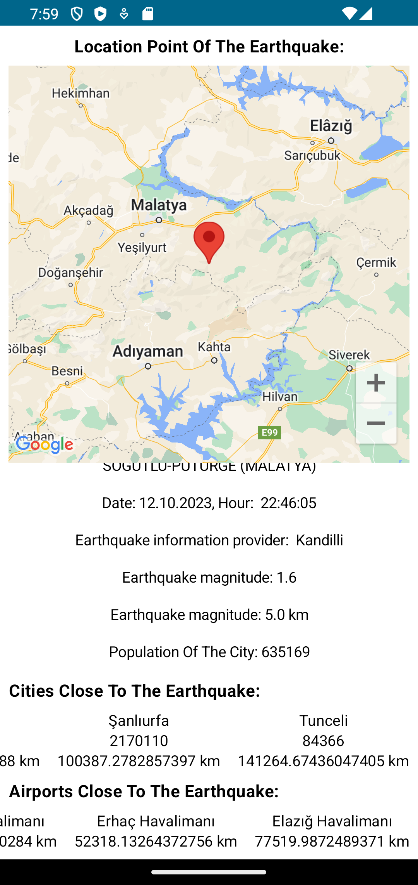 | 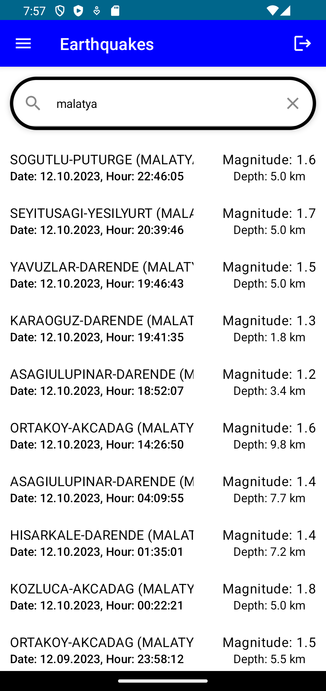 |

## Teknoloji Yığını
- [Kotlin](https://developer.android.com/kotlin) - Kotlin, JVM üzerinde çalışabilen bir programlama dilidir. Google, Android Studio'da resmi olarak desteklenen programlama dillerinden biri olarak Kotlin'i duyurdu; ve Android topluluğu, Java'dan Kotlin'e büyük bir hızla geçiş yapıyor.
- [Jetpack Compose](https://developer.android.com/jetpack/compose) - Jetpack Compose, yerel kullanıcı arayüzü oluşturmak için Android'in önerdiği modern araç setidir. Android'de kullanıcı arayüzü geliştirmeyi basitleştirip hızlandırır.
- Jetpack bileşenleri:
    - [Android KTX](https://developer.android.com/kotlin/ktx.html) - Android KTX, Android Jetpack ve diğer Android kitaplıklarına dahil olan bir Kotlin uzantısı grubudur. KTX uzantıları; Jetpack, Android platformu ve diğer API'lere kısa ve öz deyimler sunan Kotlin sağlar.
    - [AndroidX](https://developer.android.com/jetpack/androidx) - Artık korunmayan orijinal Android ([Support Library](https://developer.android.com/topic/libraries/support-library/index)) Destek Kitaplığı'nda büyük gelişme.
    - [Lifecycle](https://developer.android.com/topic/libraries/architecture/lifecycle) - Yaşam döngüsüne duyarlı bileşenler, etkinlikler ve parçalar gibi başka bir bileşenin yaşam döngüsü durumundaki bir değişikliğe yanıt olarak eylemler gerçekleştirir. Bu bileşenler, bakımı daha kolay olan daha iyi organize edilmiş ve genellikle daha hafif kodlar üretmenize yardımcı olur.
    - [ViewModel](https://developer.android.com/topic/libraries/architecture/viewmodel) - ViewModel sınıfı, UI ile ilgili verileri yaşam döngüsüne duyarlı bir şekilde depolamak ve yönetmek için tasarlanmıştır.
    - [Pager](https://developer.android.com/jetpack/compose/layouts/pager) - İçerikler arasında sol ve sağ ya da yukarı ve aşağı yönde geçiş yapmak için sırasıyla HorizontalPager ve VerticalPager bestelerini kullanabilirsiniz. Bu bestelerin işlevleri, görünüm sistemindeki ViewPager ile benzerdir.
	
- [Kotlin Coroutines](https://developer.android.com/kotlin/coroutines) - Eşzamansız olarak yürütülen kodu basitleştirmek için Android'de kullanabileceğiniz bir eşzamanlılık tasarım modeli.
- [Retrofit](https://square.github.io/retrofit) -  Retrofit, Apache 2.0 lisansı altında Square inc tarafından Java/ Kotlin ve Android için bir REST istemcisidir. Ağ işlemleri için kullanılan basit bir ağ kitaplığıdır. Bu kitaplığı kullanarak, web hizmetinden/web API'sinden JSON yanıtını sorunsuz bir şekilde yakalayabiliriz.
- [Kotlin Flow](https://developer.android.com/kotlin/flow) - Eşzamanlılarda akış, yalnızca tek bir değer döndüren askıya alma işlevlerinin aksine sırayla birden çok değer yayan bir türdür. Örneğin, bir veritabanından canlı güncellemeler almak için bir akış kullanabilirsiniz.
- [Dagger Hilt](https://developer.android.com/training/dependency-injection/hilt-android) - Android için, projenizde manuel dependency injection yapma şablonunu azaltan bir dependency injection kitaplığı.
- [Logging Interceptor](https://github.com/square/okhttp/blob/master/okhttp-logging-interceptor/README.md) - HTTP isteğini ve yanıt verilerini günlüğe kaydeder.
- [Firebase Authentication](https://firebase.google.com/docs/auth) - Firebase Authentication, uygulamanızda kullanıcıların kimliğini doğrulamak için arka uç hizmetleri, kullanımı kolay SDK'lar ve hazır kullanıcı arabirimi kitaplıkları sağlar. Parolalar, telefon numaraları, Google, Facebook ve Twitter gibi popüler birleştirilmiş kimlik sağlayıcıları ve daha fazlasını kullanarak kimlik doğrulamayı destekler.
- [Firebase Cloud Firestore](https://firebase.google.com/docs/firestore) - Cloud Firestore, Firebase ve Google Cloud'dan mobil, web ve sunucu geliştirme için esnek, ölçeklenebilir bir veritabanıdır.
- [Firebase Cloud Messaging](https://firebase.google.com/docs/cloud-messaging) - Firebase Cloud Messaging (FCM), hiçbir ücret ödemeden güvenilir bir şekilde mesaj göndermenize olanak tanıyan platformlar arası bir mesajlaşma çözümüdür.
- [Lottie](https://lottiefiles.com/) -  LottieFiles, Motion Design'ın karmaşıklığını ortadan kaldırır. Mümkün olan en kolay şekilde bir Lottie Oluşturmanıza, Düzenlemenize, Test Etmenize, İşbirliği Yapmanıza ve Sevk Etmenize olanak tanır.
- [Swiperefreshlayout](https://developer.android.com/jetpack/androidx/releases/swiperefreshlayout) - UI modelini yenilemek için kaydırmayı uygulayın.
- [Google Maps](https://developers.google.com/maps) - Google Haritalar Platformu'nun en yeni Haritalar, Rotalar ve Yerler özellikleriyle gerçek zamanlı deneyimler oluşturun. Google ekibi tarafından dünyanın her yerindeki geliştiriciler için geliştirildi.
- [WorkManager](https://developer.android.com/topic/libraries/architecture/workmanager) - WorkManager, kararlı çalışma için önerilen çözümdür. İş, uygulamanın yeniden başlatılması ve sistemin yeniden başlatılması yoluyla programlanmış olarak kaldığında kalıcıdır. Çoğu arka plan işlemi en iyi kalıcı çalışmayla gerçekleştirildiğinden WorkManager, arka planda işleme için önerilen birincil API'dir.
